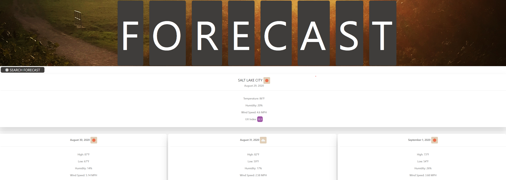

# weather-dashboard

[Click here to Visit the Site](https://duckduckgo.com)

# Post-mortem
This was a great learning experience and an opportunity to experiment with various different coding concepts. I build the styling using uikit framework. I also created an object with methods to help dynamically create html elements to append to the DOM using jquery. I used Open Weather API to populate the current weather and forecasting data. jQuery was used to create API calls. Although uikit is a great framework and has excellent documentation, it was a challenge to working with nested HTML elements and jQuery to dynamically manipulate the DOM; however, it was extremely rewarding once I got it working!